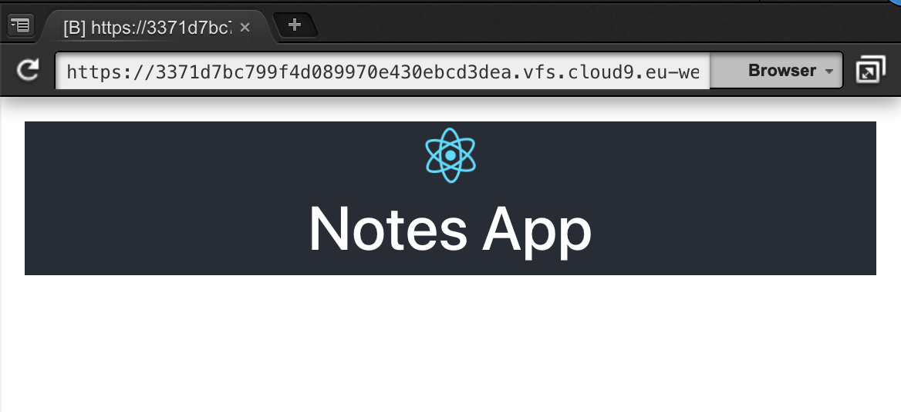
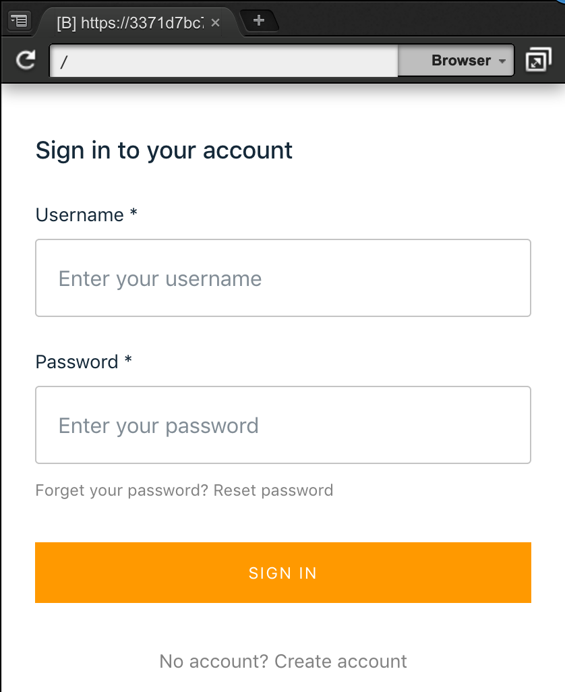
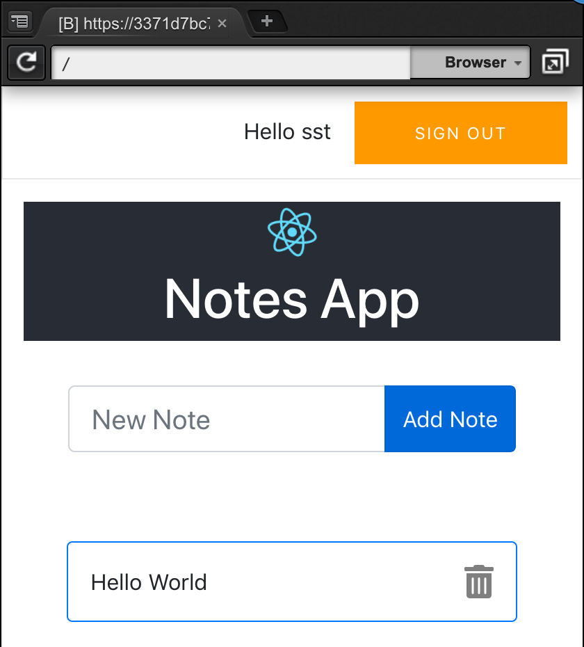

# Amplify & React Native Demo

This code and readme was built to illustrate the demo of the AWS Dev Day 2019 talk: "Integrate your front end apps with serverless backend in the cloud"
This talk has been proposed to a couple of third-party conferences as well.

The original app idea and steps are taken from [this blog post](https://medium.com/open-graphql/create-a-multiuser-graphql-crud-l-app-in-10-minutes-with-the-new-aws-amplify-cli-and-in-a-few-73aef3d49545
) from my Australian Solution Architect colleague [Ed Lima](https://twitter.com/ednergizer).

## Before the demo

I strongly suggest to go through the prerequisites and the phase 0, the initial scaffolding for the app, **before** you start the demo, as these steps take 10-15 minutes to complete.

### Prerequisites

- Have a dev machine, either your laptop or [Cloud 9](https://aws.amazon.com/cloud9/getting-started/)

- Have `node` v8.x or later.  On Cloud9 , type :

```bash
# add Node 10.15 and make it default 
$ nvm install 10.15

# verify the installation
$ node --version 
v10.15.1

# make it the default for every sessions
$ echo "nvm use 10.15" >> ~/.bash_profile
```

- Install `amplify` command line and `create-react-app`

```bash
# install amplify command line tools
$ npm install -g @aws-amplify/cli

# install create react app script (only required if you do not git clone this repo)
$ npm install -g create-react-app

# verify the installation 
$ amplify --version
1.1.3
$ create-react-app --version
2.1.5

# if you do not have AWS CLI installed, configure amplify
# and provide it with an IAM user name, access key and secret key
# this is not necessary on Cloud9 (see below)
$ amplify configure 
```

Alternatively, on Cloud9, you can just supply with an `~/.aws/config` file by typing :

```bash
$ cat <<EOF > ~/.aws/config
[default]
region=eu-west-1
EOF
```

### Phase 0 : create a basic app

I recommend to start from the github repo at https://github.com/sebsto/amplify-react-workshop

1. Scaffold the app 

```bash
$ git clone https://github.com/sebsto/amplify-react-workshop

# install dependencies (takes 4 minutes on an m4.large instance)
$ cd amplify-react-workshop
$ npm install
```

Should you want to build the experience from scratch by yourself, this is the way to scaffold your app :

```bash
# to do only if you did not clone the repo as instructed above
$ npx create-react-app amplify-react-workshop
$ cd amplify-react-workshop
$ npm install --save aws-amplify aws-amplify-react bootstrap
```

2. Initialize `ampify`

```bash
$ amplify init 
? Enter a name for the project amplifyreactworkshop
? Enter a name for the environment dev
? Choose your default editor: None
? Choose the type of app that you re building javascript
Please tell us about your project
? What javascript framework are you using react
? Source Directory Path:  src
? Distribution Directory Path: build
? Build Command:  npm run-script build
? Start Command: npm run-script start
Using default provider  awscloudformation


For more information on AWS Profiles, see:
https://docs.aws.amazon.com/cli/latest/userguide/cli-multiple-profiles.html

? Do you want to use an AWS profile? Yes
? Please choose the profile you want to use default
⠋ Initializing project in the cloud...

... (takes 3 minutes to complete) ...

✔ Successfully created initial AWS cloud resources for deployments.
✔ Initialized provider successfully.
Initialized your environment successfully.

Your project has been successfully initialized and connected to the cloud!
```

3. Customize the look and feel (optional)

Open `App.css` and locate `App-header` (line 10).  
Remove : `min-height` line  
Add : `height: 100px;`

The `App-Header` should look like this :

```css
.App-header {
  background-color: #282c34;
  height: 100px;
  display: flex;
  flex-direction: column;
  align-items: center;
  justify-content: center;
  font-size: calc(10px + 2vmin);
  color: white;
}
```

4. Start the app 

```
$ npm start 
```

Then open `Preview` => `Preview running application` in Cloud 9 or open a browser tab and connect to `http://localhost:8080/`

Alternatively, the `Preview` tab in Cloud9 will give you an URL you can connect from your laptop's browser.  This is often more convenient to debug as it gives you access to all the browser debugger tools.  The URL will look like `https://3371d7bc799f4d089970e430ebcd3dea.vfs.cloud9.eu-west-1.amazonaws.com`  The exact URL will be different for your environment.

Your app should look like this:



This should be the starting point of the live demo.

## Demo on stage

Keep the app running an open a new Terminal Tab.  On Cloud9, click on `Window` => `New Terminal` and immediately `cd amplify-react-workshop/` for the rest of the demo.

For each demo step, switch to the demo instructions when told so in the slide deck.  Go through the demo steps.  While cloud services are being created, go back to the slide and show the architecture being created.  The time to explain the architecture should be enough for the command to complete.  After you explained the architecture, come back to the terminal, change the source code and show the result.

### Phase 1 : add user authentication

Create backend services to support user authentication.

```bash
$ amplify add auth

Using service: Cognito, provided by: awscloudformation
 The current configured provider is Amazon Cognito. 
 Do you want to use the default authentication and security configuration? Yes, use the default confi
guration.
Successfully added resource cognito425d1f4b locally

$ amplify push 

Current Environment: dev

| Category | Resource name   | Operation | Provider plugin   |
| -------- | --------------- | --------- | ----------------- |
| Auth     | cognito425d1f4b | Create    | awscloudformation |
? Are you sure you want to continue? Yes
⠙ Updating resources in the cloud. This may take a few minutes...

... (it takes 2-3 minutes to complete) ...

✔ All resources are updated in the cloud
```

While the services are being provisioned, show the architecture slide and come back to modify the source.

```javascript
import Amplify from 'aws-amplify';
import { withAuthenticator } from 'aws-amplify-react';
import aws_exports from './aws-exports.js';
Amplify.configure(aws_exports);

export default withAuthenticator(App, { includeGreetings : true});
```

Alternatively, use the terminal to modify the app based on `src/App1.js`:

 ```bash
 $ cp src/App.1.js src/App.js
 ```

 This should trigger the compilation and a refresh in the browser.  You can observe the progress of compilation in the terminal tab where you launched the server.  If the browser does not refresh automatically, just force a refresh when compilation has finished.



Demo the signin process :
- create an account (using valid email address and password with upper case, number and sign, such as `Passw0rd;`) 
- check your email 
- confirm the account creation from the email 
- login in the app 

### Phase 2 : add a GraphQL API

Phase 2 is about adding a GraphQL API with a simple schema and data model.

```bash
$ amplify add api 
? Please select from one of the below mentioned services GraphQL
? Provide API name: amplifyreactworkshop
? Choose an authorization type for the API Amazon Cognito User Pool
Use a Cognito user pool configured as a part of this project
? Do you have an annotated GraphQL schema? No
? Do you want a guided schema creation? Yes
? What best describes your project: Objects with fine-grained access control (e.g., a project managem
ent app with owner-based authorization)
? Do you want to edit the schema now? Yes
Please manually edit the file created at /home/ec2-user/environment/amplify-react-workshop/amplify/backend/api/amplifyreactworkshop/schema.graphql
```

Open the file listed above and add this schema :

```graphql
type Note @model @auth(rules: [{allow: owner}]){
  id: ID!
  note: String!
}
```

Save the file, come back to the `amplify` CLI and press `enter` to continue.  You should see the message 

```
GraphQL schema compiled successfully.
```

Finally, push the changes to the server

```bash
$ amplify push

Current Environment: dev

| Category | Resource name        | Operation | Provider plugin   |
| -------- | -------------------- | --------- | ----------------- |
| Api      | amplifyreactworkshop | Create    | awscloudformation |
| Auth     | cognito425d1f4b      | No Change | awscloudformation |
? Are you sure you want to continue? Yes

GraphQL schema compiled successfully.
Edit your schema at /home/ec2-user/environment/amplify-react-workshop/amplify/backend/api/amplifyreactworkshop/schema.graphql or place .graphql files in a directory at /home/ec2-user/environment/amplify-react-workshop/amplify/backend/api/amplifyreactworkshop/schema
? Do you want to generate code for your newly created GraphQL API Yes
? Choose the code generation language target javascript
? Enter the file name pattern of graphql queries, mutations and subscriptions src/graphql/**/*.js
? Do you want to generate/update all possible GraphQL operations - queries, mutations and subscriptio
ns Yes
? Enter maximum statement depth [increase from default if your schema is deeply nested] 2
⠹ Updating resources in the cloud. This may take a few minutes...

... (it takes 2-3 minutes) ...
```

Use the terminal to modify the app based on `src/App2.js`:

 ```bash
 $ cp src/App.2.js src/App.js
 ```

 This should trigger the compilation and a refresh in the browser.  You can observe the progress of compilation in the terminal tab where you launched the server.  If the browser does not refresh automatically, just force a refresh when compilation has finished.



Demo the app by adding and deleting a few notes.  You can show that the Notes are added to DynamoDB.

Note : if you built the app from scratch, instead of cloning my git repo, you will need to add FontAwesome in `public/index.html:5`.  This will allow to use the trash can icon to delete Notes.

```html
<link rel="stylesheet" href="https://use.fontawesome.com/releases/v5.7.1/css/all.css" integrity="sha384-fnmOCqbTlWIlj8LyTjo7mOUStjsKC4pOpQbqyi7RrhN7udi9RwhKkMHpvLbHG9Sr" crossorigin="anonymous">
```

### Phase 3 : Add search capabilities

In this last phase, we are going to add search capabilities.  

Let's edit the GraphQL schema at `amplify/backend/api/amplifynotes/schema.graphql` and add `@searchable` on the first line.  Full schema must look like this :

```graphql
type Note @model @auth(rules: [{allow: owner}]) @searchable {
  id: ID!
  note: String!
}
```
And push the change to the backend.  

```
$ amplify push 

Current Environment: dev

| Category | Resource name        | Operation | Provider plugin   |
| -------- | -------------------- | --------- | ----------------- |
| Api      | amplifyreactworkshop | Update    | awscloudformation |
| Auth     | cognito425d1f4b      | No Change | awscloudformation |
? Are you sure you want to continue? Yes

GraphQL schema compiled successfully.
Edit your schema at /home/ec2-user/environment/amplify-react-workshop/amplify/backend/api/amplifyreactworkshop/schema.graphql or place .graphql files in a directory at /home/ec2-user/environment/amplify-react-workshop/amplify/backend/api/amplifyreactworkshop/schema
? Do you want to update code for your updated GraphQL API Yes
? Do you want to generate GraphQL statements (queries, mutations and subscription) based on your sche
ma types? This will overwrite your current graphql queries, mutations and subscriptions Yes
⠹ Updating resources in the cloud. This may take a few minutes...

... (it takes 10 minutes) ...
```

While the server side infrastructure is created, explain the architecture being created using the next slide in the slide deck.  

When back to the demo, use the terminal to modify the app based on `src/App.3.js`:

 ```bash
 $ cp src/App.3.js src/App.js
 ```

 This should trigger the compilation and a refresh in the browser.  You can observe the progress of compilation in the terminal tab where you launched the server.  If the browser does not refresh automatically, just force a refresh when compilation has finished.

 Show the search is working.  Please pay attention to the following :

 - only new notes are indexed and searchable.  The ones created before have not been ingested automatically to the index.

 - search is on full words only, do not search for substrings.

### Phase 4 : Publish your app 

Publish your app to make it accessible to the world.

```bash
$ amplify add hosting 
? Select the environment setup: DEV (S3 only with HTTP)
? hosting bucket name amplifyreactworkshop-20190220174529-hostingbucket
? index doc for the website index.html
? error doc for the website index.html

You can now publish your app using the following command:
Command: amplify publish

$ amplify publish
```

Be sure to choose `dev` publishing.  `prod` is causing `amplify` to create a CloudFront distribution, which takes 10-15 minutes.  

`amplify publish` will make a full project compile, packaging, create the bucket and deploy your app.  While it does that, go back to the slide to explain the infrastructure being created.

Demo the app by connecting to the public web site just having been created.

 ## Cleanup 

  Congrats ! Demo is finished.  You now have a basic CRUD application, with user authentication and full search capabilities.
  
  To cleanup resources, follow these steps :

